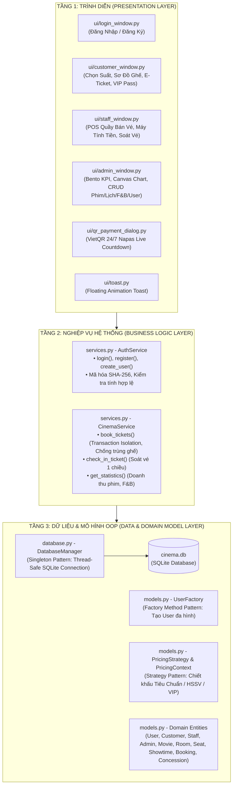
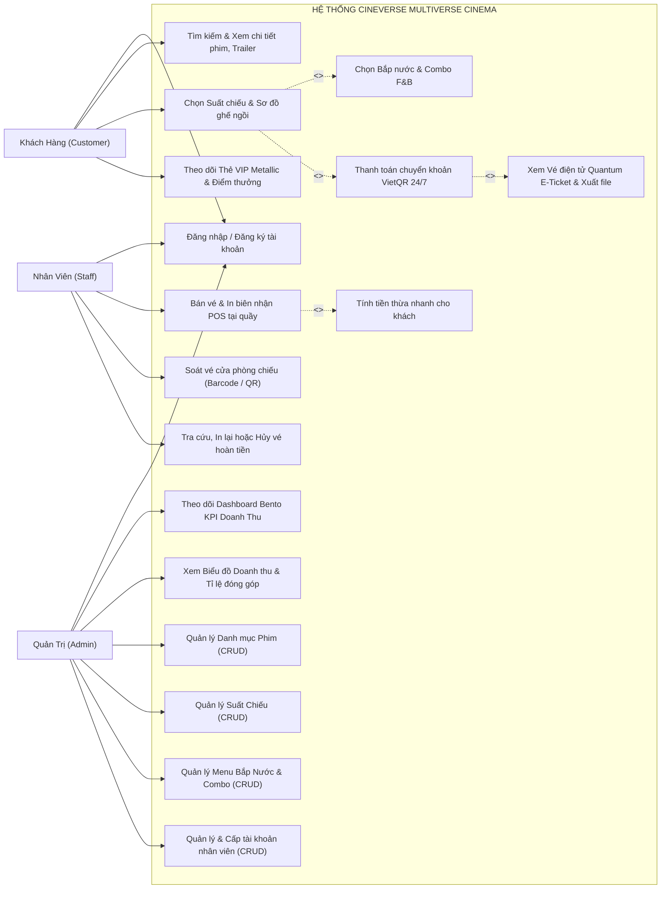
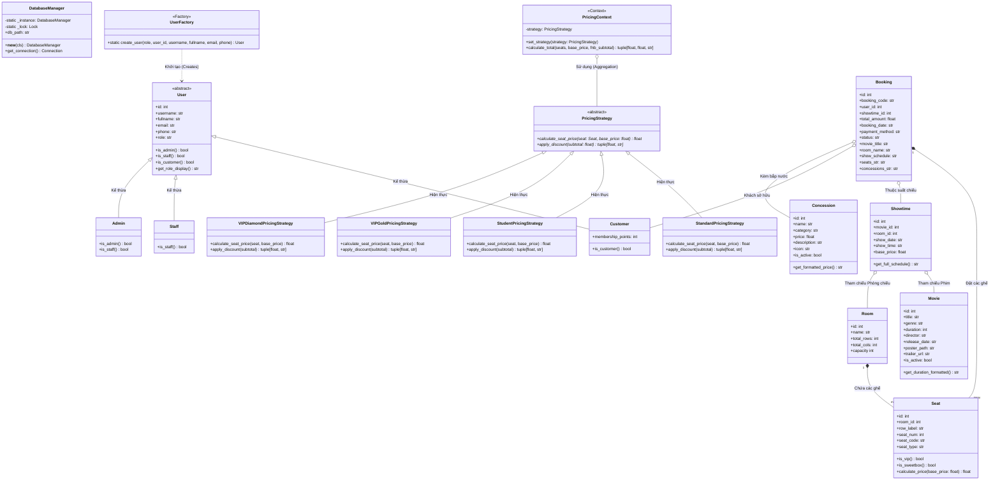
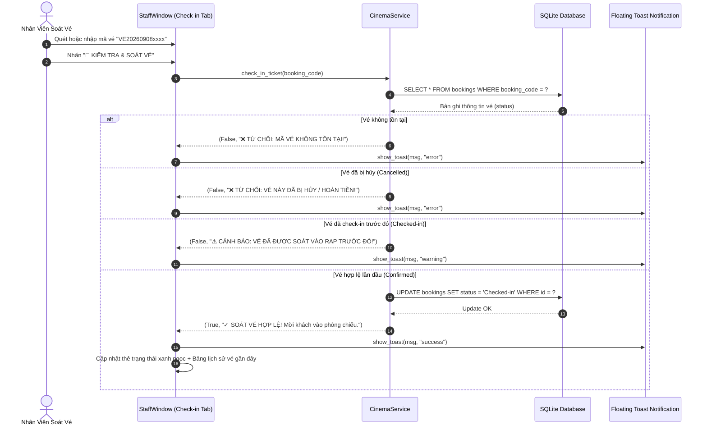

# CINEVERSE — BÁO CÁO THIẾT KẾ KIẾN TRÚC PHẦN MỀM & HỒ SƠ UML HỌC THUẬT

> **Đồ Án**: Hệ Thống Quản Lý & Đặt Vé Xem Phim Đa Vũ Trụ Điện Ảnh (CINEVERSE)  
> **Ngôn ngữ**: Python 3.11+ | **GUI Framework**: CustomTkinter / Tkinter | **CSDL**: SQLite3  
> **Kiến trúc**: 3-Tier Layered Architecture | **Mẫu thiết kế (Design Patterns)**: Singleton, Factory Method, Strategy

---

## 1. TỔNG QUAN KIẾN TRÚC PHÂN TẦNG (3-TIER LAYERED ARCHITECTURE)

Hệ thống được thiết kế theo mô hình **Kiến trúc 3 tầng (3-Tier Architecture)** phân tách độc lập trách nhiệm (Separation of Concerns):
- **Tầng Giao Diện (Presentation Layer)**: Đảm nhận hiển thị, tương tác người dùng, animation, toast và đồ họa Canvas.
- **Tầng Nghiệp Vụ (Business Logic Layer)**: Đảm nhận xử lý thuật toán, kiểm tra nghiệp vụ, chống trùng ghế, xác thực phân quyền và tích lũy điểm thưởng.
- **Tầng Dữ Liệu & Mô Hình Đối Tượng (Data Access & Domain Model Layer)**: Chứa các lớp thực thể OOP thuần túy, mẫu thiết kế khởi tạo/tính giá và quản lý kết nối CSDL tập trung.



---

## 2. SƠ ĐỒ CA SỬ DỤNG (UML USE CASE DIAGRAM)

Hệ thống phục vụ **3 Tác nhân (Actors)** chính trong một chu trình rạp phim khép kín:
1. **Khách Hàng (Customer)**: Đặt vé online, chọn ghế, chọn bắp nước, quét mã QR thanh toán, theo dõi thẻ hội viên VIP.
2. **Nhân Viên Rạp (Staff)**: Xuất vé tại quầy POS, tính tiền thừa, kiểm soát vé vào rạp tại cửa phòng chiếu, tra cứu/hủy vé.
3. **Quản Trị Viên (Admin)**: Toàn quyền quản trị hệ thống, giám sát doanh thu thời gian thực, quản lý phim, lịch chiếu, menu F&B và cấp phát tài khoản.



---

## 3. SƠ ĐỒ LỚP TỔNG THỂ (UML CLASS DIAGRAM)

Sơ đồ lớp chi tiết dưới đây thể hiện trọn vẹn:
- Quan hệ **Kế thừa (Inheritance)** từ `User` sang `Customer`, `Staff`, `Admin`.
- Mẫu thiết kế **Factory Method**: `UserFactory` khởi tạo các đối tượng User đa hình.
- Mẫu thiết kế **Strategy**: `PricingStrategy` và các hiện thực hóa cụ thể (`StandardPricingStrategy`, `StudentPricingStrategy`, `VIPGoldPricingStrategy`, `VIPDiamondPricingStrategy`), được bao đóng bởi `PricingContext`.
- Mẫu thiết kế **Singleton**: `DatabaseManager` bảo đảm duy nhất một thể hiện kết nối an toàn đa luồng.
- Các quan hệ **Kết tập (Aggregation)** và **Thành phần (Composition)** giữa `Booking`, `Seat`, `Showtime`, `Movie`, `Room`, `Concession`.



---

## 4. SƠ ĐỒ TRÌNH TỰ (UML SEQUENCE DIAGRAMS)

### 4.1. Luồng 1: Quy Trình Đặt Vé, Tính Giá Chiến Lược (Strategy) & Thanh Toán VietQR

```mermaid
sequenceDiagram
    autonumber
    actor Customer as Khách Hàng (User)
    participant UI as CustomerWindow (UI)
    participant Service as CinemaService
    participant Context as PricingContext
    participant Strategy as PricingStrategy
    participant DB as SQLite Database
    participant QR as QRPaymentDialog

    Customer ->> UI: Chọn ghế (C3, C4) & Bắp nước (Pepsi, Bắp Caramel)
    Customer ->> UI: Nhấn "💳 XÁC NHẬN THANH TOÁN"
    UI ->> QR: Mở Popup VietQR 24/7 (Live Countdown 10:00)
    Customer ->> QR: Quét App Ngân hàng & Bấm "TÔI ĐÃ CHUYỂN KHOẢN"
    QR -->> UI: Callback Xác Nhận Thanh Toán Thành Công
    UI ->> Service: book_tickets(user_id, showtime_id, seats, concessions, pricing_strategy)
    
    rect rgb(20, 25, 45)
        Note over Service, DB: TRANSACTION ISOLATION (CHỐNG TRÙNG GHẾ)
        Service ->> DB: BEGIN TRANSACTION
        Service ->> DB: SELECT seat_code FROM bookings WHERE status='Confirmed'
        DB -->> Service: Danh sách ghế đã bán
        Service ->> Context: calculate_total(seats, base_price, fnb_amount)
        Context ->> Strategy: calculate_seat_price(seat, base_price)
        Strategy -->> Context: Giá ghế theo phân loại (Standard/VIP/Sweetbox)
        Context ->> Strategy: apply_discount(subtotal)
        Strategy -->> Context: (tổng_sau_giảm, mô_tả_ưu_đãi)
        Context -->> Service: grand_total

        Service ->> DB: INSERT INTO bookings (booking_code, total_amount, payment_method, ...)
        Service ->> DB: INSERT INTO booking_details (booking_id, seat_id, ...)
        Service ->> DB: INSERT INTO booking_concessions (booking_id, concession_id, ...)
        Service ->> DB: COMMIT TRANSACTION
    end

    Service -->> UI: (True, "Đặt vé thành công!", booking_obj)
    UI ->> UI: show_toast("Đặt vé thành công!", "success")
    UI ->> Customer: Hiển thị Vé Điện Tử (Quantum E-Ticket) + Tùy chọn Xuất File .txt
```



---

### 4.2. Luồng 2: Quy Trình Soát Vé Cửa Rạp & Chống Vé Gian Lận Trùng Lặp



---

## 5. THUYẾT MINH CHUYÊN SÂU 3 MẪU THIẾT KẾ (DESIGN PATTERNS DEEP-DIVE)

### 5.1. Mẫu Thiết Kế Singleton (Singleton Pattern)
- **Vị trí**: [`database.py`](file:///d:/IT/Python/Cinema/database.py) — Lớp `DatabaseManager`.
- **Vấn đề giải quyết**: Tránh việc mở kết nối rải rác, gây tốn tài nguyên hệ điều hành hoặc xung đột file SQLite khi nhiều luồng truy cập đồng thời.
- **Cách thức hiện thực**:
  - Ghi đè phương thức `__new__` của Python.
  - Sử dụng biến tĩnh `_instance` lưu giữ thể hiện duy nhất.
  - Áp dụng `threading.Lock()` theo kỹ thuật **Double-Checked Locking** bảo đảm an toàn đa luồng tuyệt đối.
- **Đoạn code minh chứng**:
  ```python
  class DatabaseManager:
      _instance = None
      _lock = threading.Lock()

      def __new__(cls, *args, **kwargs):
          if not cls._instance:
              with cls._lock:
                  if not cls._instance:
                      cls._instance = super().__new__(cls)
                      cls._instance.db_path = DB_NAME
          return cls._instance
  ```

---

### 5.2. Mẫu Thiết Kế Factory Method (Factory Method Pattern)
- **Vị trí**: [`models.py`](file:///d:/IT/Python/Cinema/models.py) — Lớp `UserFactory`.
- **Vấn đề giải quyết**: Tách rời tầng khởi tạo người dùng khỏi tầng nghiệp vụ và tầng CSDL. Thay vì viết các câu lệnh `if-elif-else` phân nhánh rải rác ở khắp các tệp `services.py`, toàn bộ logic phân quyền đối tượng con được gom về một đầu mối tập trung.
- **Nguyên lý SOLID đáp ứng**: **Single Responsibility Principle (SRP)** — Chỉ có `UserFactory` chịu trách nhiệm quyết định khởi tạo lớp người dùng nào.
- **Đoạn code minh chứng**:
  ```python
  class UserFactory:
      @staticmethod
      def create_user(role: str, user_id: int, username: str, fullname: str, email: str = "", phone: str = "") -> User:
          role_key = (role or "").strip().lower()
          if role_key == "admin":
              return Admin(user_id, username, fullname, email, phone)
          elif role_key == "staff":
              return Staff(user_id, username, fullname, email, phone)
          else:
              return Customer(user_id, username, fullname, email, phone)
  ```

---

### 5.3. Mẫu Thiết Kế Chiến Lược (Strategy Pattern)
- **Vị trí**: [`models.py`](file:///d:/IT/Python/Cinema/models.py) — `PricingStrategy`, `PricingContext`.
- **Vấn đề giải quyết**: Rạp chiếu phim thường xuyên thay đổi chính sách giá vé và ưu đãi (Giá tiêu chuẩn, Giảm giá Học sinh/Sinh viên 10%, Chiết khấu Hội viên Vàng 5%, Hội viên Kim Cương 10%, hoặc các đợt flash sale). Nếu dùng các câu lệnh `if-else` lồng nhau trong hàm đặt vé thì code sẽ bị phình to, dễ phát sinh lỗi (Code Smell).
- **Nguyên lý SOLID đáp ứng**:
  - **Open/Closed Principle (OCP)**: Hệ thống mở để mở rộng thêm các chiến lược giá mới (như `CouponPricingStrategy`, `MidnightPricingStrategy`) nhưng đóng với việc sửa đổi mã nguồn nghiệp vụ `CinemaService.book_tickets`.
  - **Dependency Inversion Principle (DIP)**: `PricingContext` và `CinemaService` phụ thuộc vào lớp trừu tượng `PricingStrategy`, không phụ thuộc vào các lớp cụ thể.
- **Đoạn code minh chứng**:
  ```python
  class PricingStrategy(ABC):
      @abstractmethod
      def calculate_seat_price(self, seat: Seat, base_price: float) -> float:
          pass

      @abstractmethod
      def apply_discount(self, subtotal: float) -> tuple[float, str]:
          pass

  class PricingContext:
      def __init__(self, strategy: PricingStrategy = None):
          self._strategy = strategy or StandardPricingStrategy()

      def calculate_total(self, seats: list[Seat], base_price: float, fnb_subtotal: float = 0.0):
          seats_subtotal = sum(self._strategy.calculate_seat_price(s, base_price) for s in seats)
          grand_raw = seats_subtotal + fnb_subtotal
          final_total, discount_desc = self._strategy.apply_discount(grand_raw)
          return grand_raw, final_total, discount_desc
  ```

---

## 6. ĐỐI SOÁT CÁC NGUYÊN LÝ THIẾT KẾ SOLID

| Nguyên lý SOLID | Cách áp dụng trong kiến trúc CINEVERSE | Lợi ích thu được |
| :--- | :--- | :--- |
| **S - Single Responsibility** *(Đơn trách nhiệm)* | `models.py` chỉ chứa thực thể; `services.py` chỉ xử lý nghiệp vụ; `ui/` chỉ vẽ giao diện; `UserFactory` chỉ khởi tạo user; `DatabaseManager` chỉ kết nối CSDL. | Dễ đọc, dễ bảo trì, cô lập lỗi nhanh chóng. |
| **O - Open/Closed** *(Mở rộng / Đóng sửa đổi)* | Bổ sung thêm chiến lược giá vé mới (`SeniorPricingStrategy`, `VoucherStrategy`) chỉ cần tạo class mới kế thừa `PricingStrategy`, không sửa 1 dòng code nào trong `book_tickets`. | Mở rộng tính năng an toàn, không sinh lỗi hồi quy. |
| **L - Liskov Substitution** *(Thay thế Liskov)* | Mọi lớp con của `User` (`Customer`, `Staff`, `Admin`) đều có thể thay thế cho `User` mà không làm thay đổi tính đúng đắn của chương trình. | Tận dụng triệt để tính đa hình (Polymorphism). |
| **I - Interface Segregation** *(Phân tách giao diện)* | `PricingStrategy` chỉ có 2 phương thức tinh gọn (`calculate_seat_price`, `apply_discount`), không bắt các lớp con hiện thực các phương thức thừa thãi. | Các lớp con gọn gàng, rõ ràng. |
| **D - Dependency Inversion** *(Đảo ngược phụ thuộc)* | `CinemaService` và `PricingContext` phụ thuộc vào Interface trừu tượng `PricingStrategy` chứ không gắn chặt vào lớp cụ thể. | Giảm mức độ phụ thuộc (Decoupling) tối đa. |

